# Gemini CLI 教學互動網站 - 規格文件

## 1. 架構與選型

### 技術選型
- **前端框架**: 純 HTML5 + CSS3 + Vanilla JavaScript
- **UI 框架**: 無依賴,使用原生 CSS Grid 與 Flexbox
- **程式碼高亮**: Prism.js
- **圖標**: Font Awesome 6
- **部署**: 靜態網站 (可直接開啟 HTML 檔案)

### 設計原則
- 單頁應用 (SPA) 風格
- 響應式設計 (RWD)
- 漸進式增強
- 無障礙設計 (WCAG 2.1)

## 2. 資料模型

```javascript
// 課程進度資料模型
{
  completedSections: Set<string>,  // 已完成的章節 ID
  lastVisited: string,              // 最後訪問的章節 ID
  timestamp: number                 // 更新時間戳
}

// 章節資料模型
{
  id: string,           // 章節唯一識別碼
  title: string,        // 章節標題
  duration: number,     // 預計時長(分鐘)
  subsections: Array<{  // 子章節
    id: string,
    title: string,
    content: string,
    codeBlocks: Array<{
      language: string,
      code: string
    }>
  }>
}
```

## 3. 關鍵流程

### 3.1 頁面載入流程
```
使用者開啟網頁
  ↓
載入 HTML/CSS/JS
  ↓
初始化側邊欄導航
  ↓
從 localStorage 讀取進度
  ↓
渲染教材內容
  ↓
綁定事件監聽器
  ↓
套用程式碼高亮
```

### 3.2 進度追蹤流程
```
使用者捲動頁面
  ↓
偵測進入可視區域的章節
  ↓
更新側邊欄當前位置指示
  ↓
使用者點擊「完成」按鈕
  ↓
標記章節為已完成
  ↓
儲存至 localStorage
  ↓
更新進度條顯示
```

### 3.3 程式碼複製流程
```
使用者點擊「複製」按鈕
  ↓
讀取程式碼區塊內容
  ↓
寫入剪貼簿
  ↓
顯示成功提示
  ↓
2秒後恢復按鈕狀態
```

## 4. 虛擬碼

### 4.1 進度管理模組
```javascript
class ProgressManager {
  constructor() {
    this.storageKey = 'gemini-cli-progress'
    this.loadProgress()
  }

  loadProgress() {
    // 從 localStorage 讀取進度
    data = localStorage.getItem(this.storageKey)
    if data exists:
      parse JSON and set completedSections
    else:
      initialize empty Set
  }

  markComplete(sectionId) {
    // 標記章節為已完成
    add sectionId to completedSections
    update localStorage
    trigger UI update
  }

  isComplete(sectionId) {
    // 檢查章節是否已完成
    return completedSections.has(sectionId)
  }

  getProgress() {
    // 計算完成百分比
    total = count all sections
    completed = size of completedSections
    return (completed / total) * 100
  }
}
```

### 4.2 導航控制模組
```javascript
class NavigationController {
  constructor() {
    this.sections = querySelectorAll('.section')
    this.navItems = querySelectorAll('.nav-item')
    this.initObserver()
  }

  initObserver() {
    // 使用 Intersection Observer 監控章節可視狀態
    observer = new IntersectionObserver(entries => {
      for each entry in entries:
        if entry.isIntersecting:
          update active navigation item
          update URL hash
    })

    for each section in sections:
      observer.observe(section)
  }

  scrollToSection(sectionId) {
    // 平滑捲動至指定章節
    element = getElementById(sectionId)
    element.scrollIntoView({ behavior: 'smooth' })
  }
}
```

### 4.3 程式碼區塊管理
```javascript
class CodeBlockManager {
  initializeAll() {
    // 初始化所有程式碼區塊
    codeBlocks = querySelectorAll('pre code')

    for each block in codeBlocks:
      apply syntax highlighting
      add copy button
      bind copy event
  }

  copyCode(button, codeElement) {
    // 複製程式碼到剪貼簿
    code = codeElement.textContent

    try:
      navigator.clipboard.writeText(code)
      show success feedback
      reset button after 2 seconds
    catch error:
      fallback to document.execCommand
  }
}
```

## 5. 系統脈絡圖

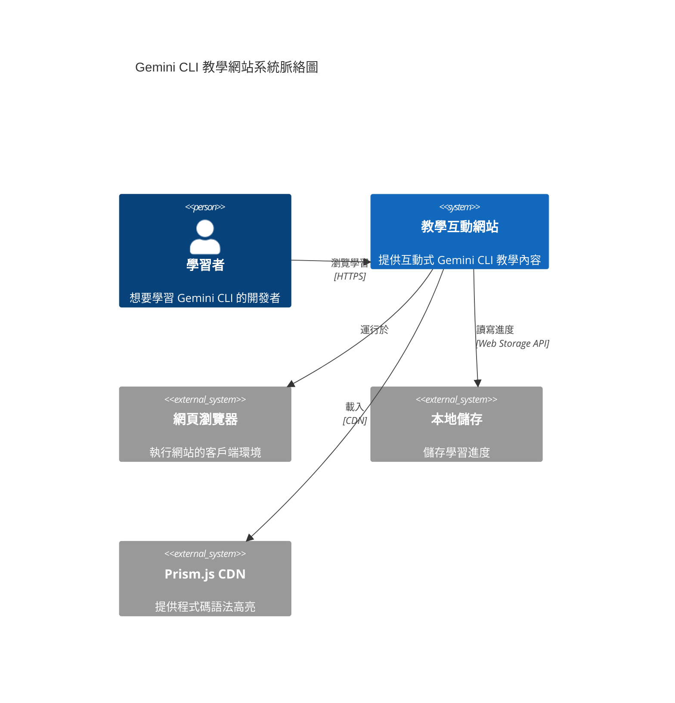

## 6. 容器/部署概觀

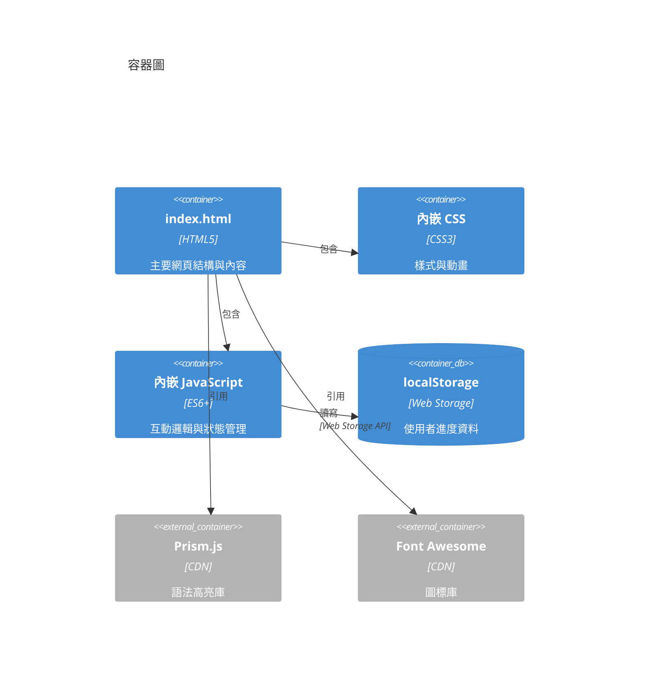

## 7. 模組關係圖

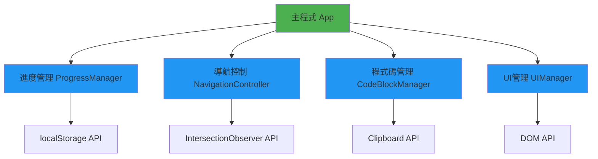

## 8. 序列圖

### 8.1 頁面初始化序列圖
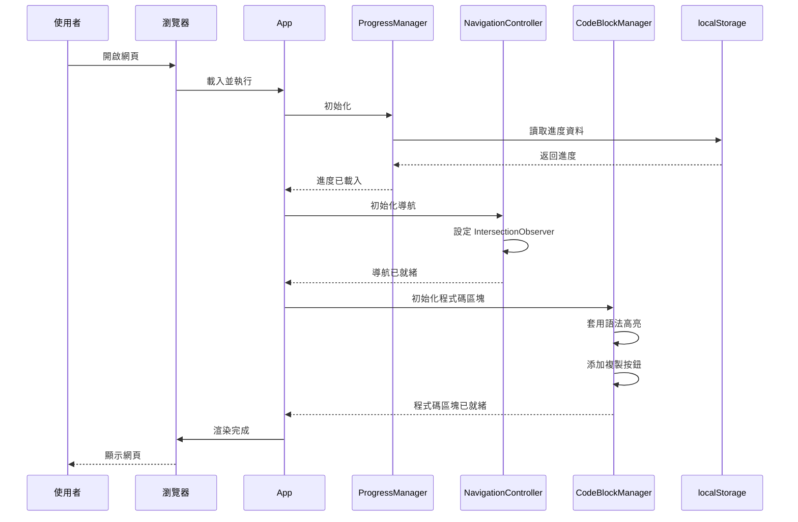

### 8.2 完成章節序列圖
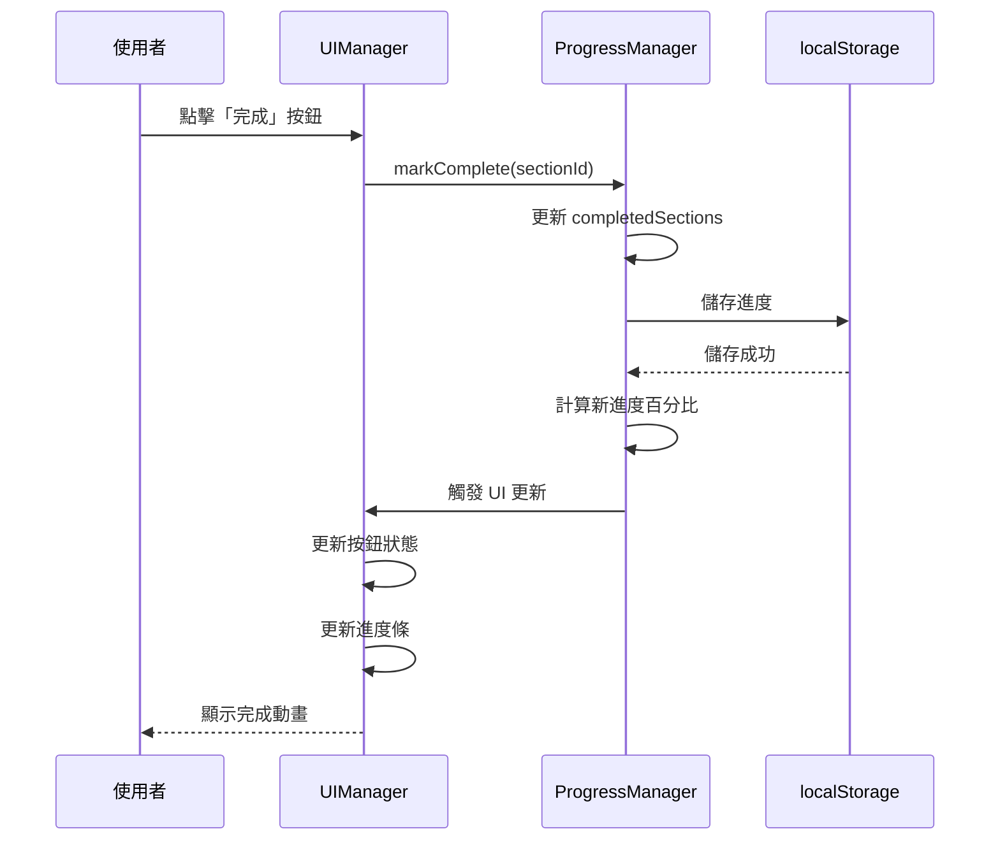

### 8.3 複製程式碼序列圖
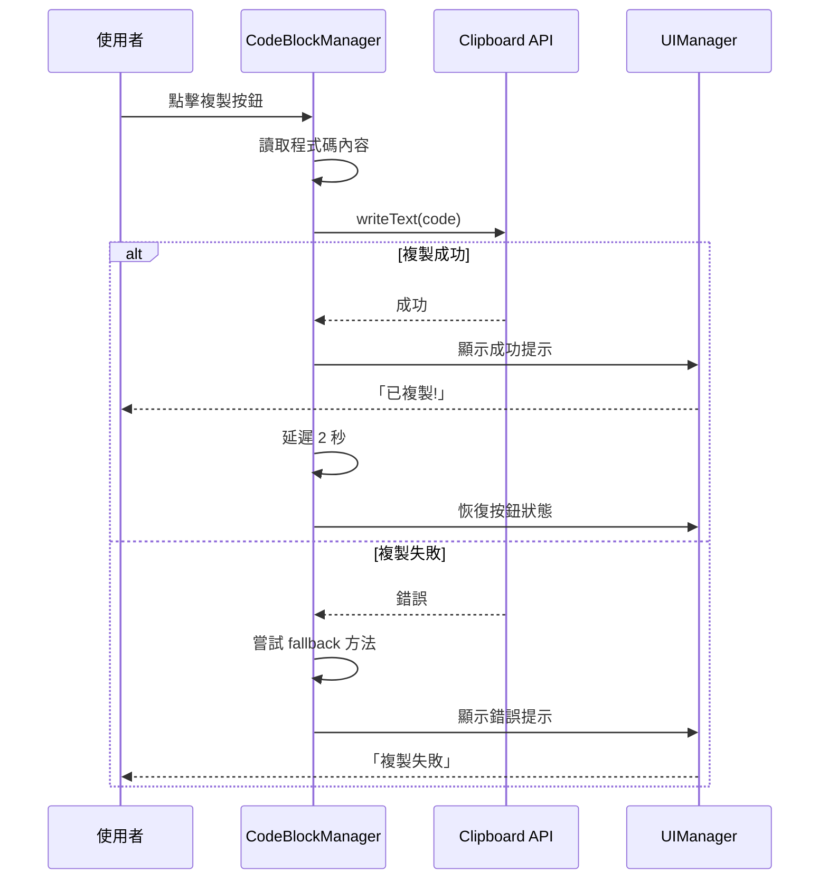

## 9. ER 圖

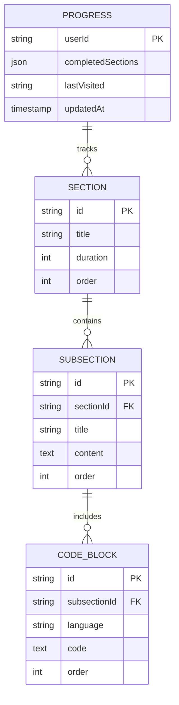

## 10. 類別圖

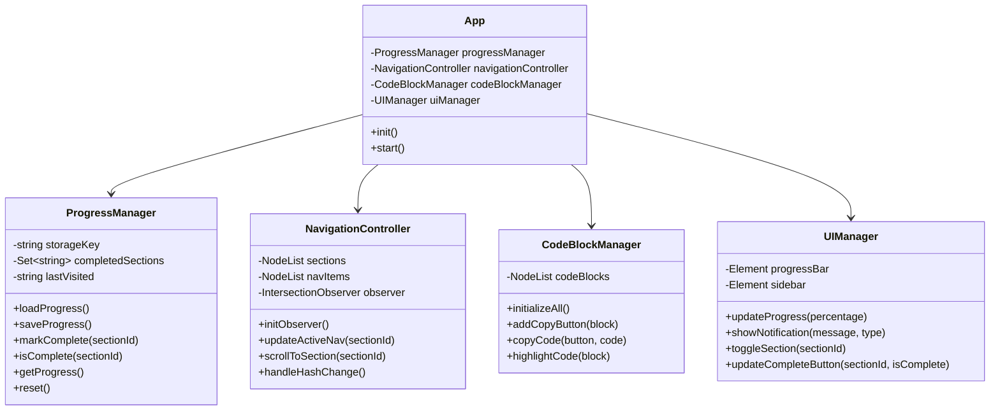

## 11. 流程圖

### 11.1 主要使用者互動流程
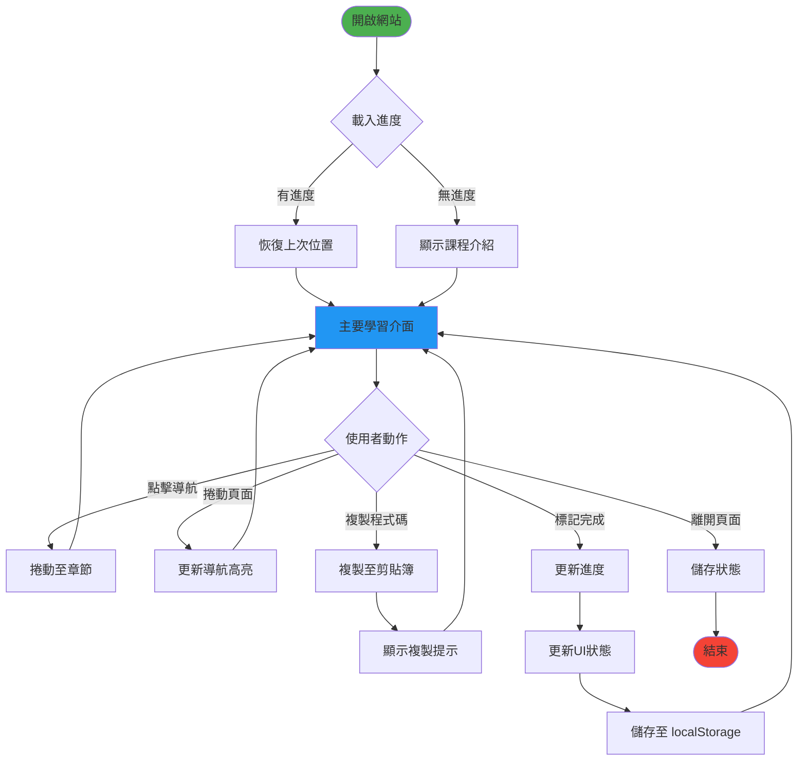

### 11.2 進度計算流程
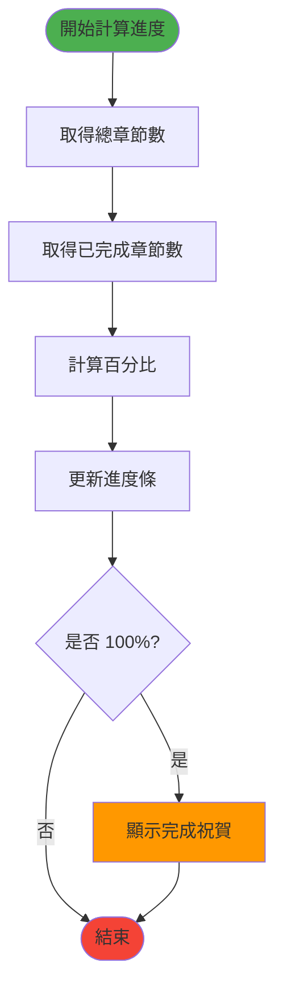

## 12. 狀態圖

### 12.1 章節狀態圖
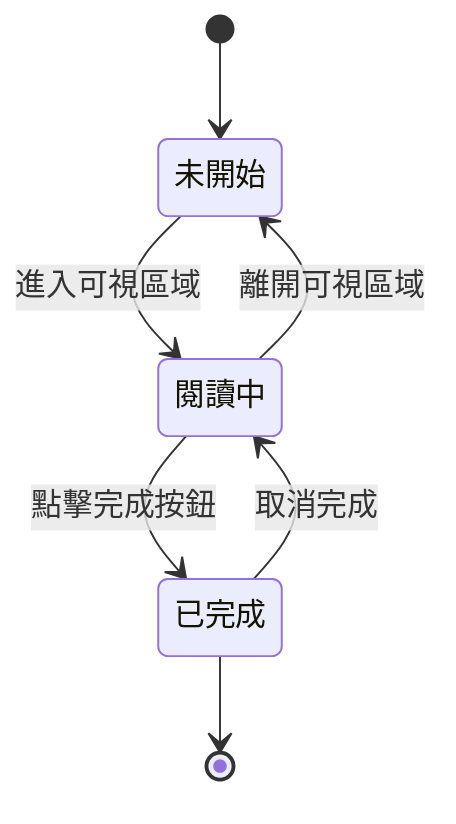

### 12.2 程式碼區塊狀態圖
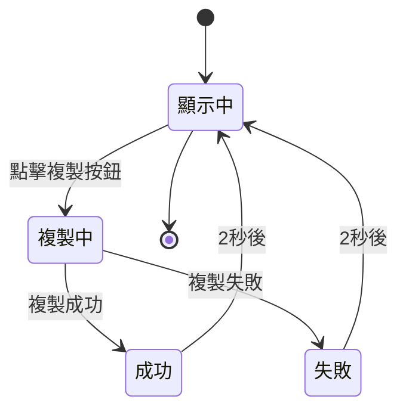

## 13. 功能需求清單

### 13.1 核心功能
- ✅ 響應式單頁設計
- ✅ 側邊欄章節導航
- ✅ 程式碼語法高亮
- ✅ 一鍵複製程式碼
- ✅ 學習進度追蹤
- ✅ 進度本地儲存
- ✅ 平滑捲動效果
- ✅ 深色主題設計

### 13.2 互動功能
- ✅ 手風琴式子章節展開
- ✅ 完成章節標記
- ✅ 進度條視覺化
- ✅ 複製成功提示
- ✅ 懸浮效果與動畫
- ✅ 鍵盤快捷鍵支援

### 13.3 用戶體驗
- ✅ 載入動畫
- ✅ 錯誤處理
- ✅ 空狀態提示
- ✅ 無障礙支援
- ✅ 列印友善樣式

## 14. 非功能需求

### 14.1 效能
- 頁面載入時間 < 2秒
- 互動回應時間 < 100ms
- 支援 10000+ 行教材內容

### 14.2 相容性
- 現代瀏覽器 (Chrome, Firefox, Safari, Edge)
- 最低支援 ES6
- 支援桌面與行動裝置

### 14.3 可維護性
- 模組化程式碼結構
- 完整的函式註解
- 清晰的命名規範

## 15. 配色方案

```css
:root {
  --primary: #1976d2;      /* 主要藍色 */
  --secondary: #424242;    /* 深灰色 */
  --success: #4caf50;      /* 成功綠色 */
  --warning: #ff9800;      /* 警告橙色 */
  --danger: #f44336;       /* 錯誤紅色 */
  --bg-dark: #1a1a2e;      /* 深色背景 */
  --bg-darker: #0f0f1e;    /* 更深背景 */
  --text-light: #e0e0e0;   /* 淺色文字 */
  --code-bg: #2d2d2d;      /* 程式碼背景 */
}
```

## 16. 檔案結構

```
Gemini CLI課程/
├── index.html           # 主要網頁 (包含 CSS 與 JS)
├── spec.md             # 本規格文件
└── 教材/
    └── Gemini_CLI_入門初學者教材.md
```

## 17. 開發檢查清單

- [ ] 規格文件審查
- [ ] HTML 結構開發
- [ ] CSS 樣式開發
- [ ] JavaScript 功能開發
- [ ] 程式碼高亮整合
- [ ] 進度儲存功能測試
- [ ] 複製功能測試
- [ ] 響應式設計測試
- [ ] 跨瀏覽器測試
- [ ] 效能優化
- [ ] 無障礙檢查
- [ ] 最終測試與部署
